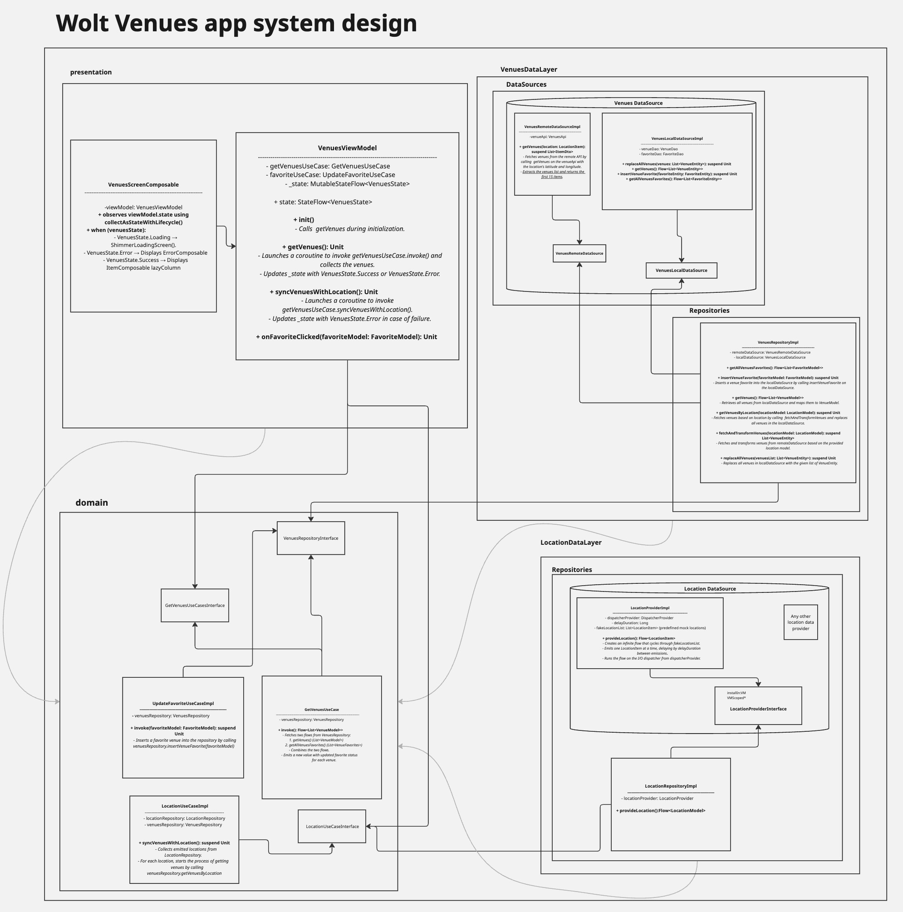

## Wolt Assignment Readme

This project is an Android Kotlin app built as part of an assignment for Wolt.
It demonstrates clean architecture, reactive programming, dependency injection, and Jetpack Compose UI to display venue data based on location.

---
## 💡 Design Considerations

- While the project currently uses mocked location data, the system is architected so that the `LocationDataSource` can seamlessly switch to a real GPS location provider.
- Thanks to clean separation of concerns and interface-based design, replacing the mock with a production-ready implementation requires no changes to the rest of the codebase.
- We have a requirement of "*If the API returns more than 15 venues display only the first 15 from the list.*" Currently I handled it in repository. But in real world this needs to be discussed with the team, below sample questions should be discussed and based on the answers we should decide where taking 15 first item should be added.  
  - is this something that backend should take care of?
  - will this logic change frequently? 
  - do we need all the data we receive from api or just this 15 items?
- In Repository and UseCases some mappings are done. I didn't switch to IO there because the list of data is not huge. But if we have a huge amount of data we need to switch to IO thread. 

## 📦 Project System Design Diagram 
As the very first step, I created a system design diagram to make the implementation easier and clearer.
Before implementation I've created a simple diagram contains main concepts then after implementing it I updated that with more details.
This diagram helps visualize the system as a whole and provides a better understanding of the responsibilities of each component. 

Miro Board Link: [View on Miro](https://miro.com/app/board/uXjVI63e-IQ=/?share_link_id=154204231591)

---

## 📦 Project Overview
The project is organized into two main modules: **`app`** and **`features`**.

Since this is an assignment, I kept the modularization simple.  
In a real-world multi-module architecture, depending on the project’s complexity and requirements, we might have **`core`** as a separate module for shared components.

### Module Overview

- **`app`**  
  Contains the `MainActivity` and the `Application` class. This module serves as the entry point of the application and handles overall app setup.

- **`venues`**  
  A feature module responsible for all functionality related to venues. This includes fetching venue data, managing favorite states, syncing with location updates, and providing UI-ready data for display.

## 🚀 Main Features

✅ Fetch venues based on changing location (using a mock location flow)  
✅ Store and update venue favorites locally  
✅ Combine venue list with favorite statuses in real time  
✅ Display venues in a Jetpack Compose `LazyColumn`  
✅ Show loading shimmer effect, error messages, and a retry option  
✅ Fully reactive architecture using Kotlin Coroutines and Flow

---

## 🔧 Tech Stack

- **Kotlin**
- **Coroutines & Flow**
- **Jetpack Compose**
- **Hilt** (for Dependency Injection)
- **Room** (for local database management)
- **Retrofit** (for API calls)
- **MVVM + Clean Architecture**

-----

## Project Improvements (Pending Due to Time Limitations)
- **Error Handling**
Currently, the project uses a basic error handling mechanism. Ideally, we should implement robust error handling at each layer (data, domain, presentation) to ensure errors are properly managed and do not leak or propagate unnecessarily to upper layers.

- **Modularization**
For sake of simplicity and time I currently have just two modules under features. In features I have venues and core packages. It needs to be restructured by separating core into its own module and converting venues to a module. This way, any additional feature module we develop can be added under the features module separately.
Additionally, I currently have Location defined within the data layer of venues, but it could also be refactored into its own separate module.

- **Proper Error Screen**
It is not the project requirement but it's better to have a proper Retry mechanism when user view the ErrorScreen.

